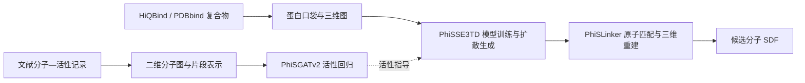

<p align="center">
  
</p>

# PhiStone 2.0

## 1. 项目概述

PhiStone 2.0 是面向抗结核小分子设计的分子建模与生成项目，整合文献活性数据整理、分子片段表示学习、二维活性预测、蛋白口袋条件扩散生成和三维分子重建。项目支持以蛋白口袋为条件的从头生成，以及保留先导分子片段后的连接与修饰，为候选分子的生成和后续筛选提供工具。

项目由以下四个主要模块组成：

| 模块 | 主要功能 |
| --- | --- |
| **PhiSSeparator** | 分子片段划分、二维 / 三维图数据构建及生成条件准备；训练轻量编码器，提供 128 维片段嵌入与 64 维原子嵌入。 |
| **PhiSGATv2** | 基于二维分子图的抗结核活性回归，并为活性指导微调提供预测模型。 |
| **PhiSSE3TD** | 基于 e3nn 等变网络的口袋条件扩散模型，支持预训练及多种生成策略微调，并设置重原子数（HAC）与环数辅助预测头。 |
| **PhiSLinker** | 片段间原子匹配与连接预测，衔接生成片段的解码和三维分子重建。 |

总体流程如下。数据处理与实验评价的详细步骤分别见 [DATA_PREPARATION.md](DATA_PREPARATION.md) 和 [EXPERIMENTS.md](EXPERIMENTS.md)。



## 2. 环境说明

训练时使用配置如下：

| 项目 | 配置 |
| --- | --- |
| Python | `3.9.23` |
| PyTorch | `2.6.0+cu124` |
| PyTorch CUDA 运行时 | `12.4`（`torch.version.cuda`） |
| GPU | 8 × NVIDIA A800-SXM4-80GB |

训练示例使用单卡启动参数，多卡训练可按实际使用的 GPU 数量调整 `--nproc_per_node`。上述配置用于记录训练条件。

### 2.1 创建通用依赖环境

[environment.yml](environment.yml) 根据 **PhiSGATv2、PhiSLinker、PhiSSE3TD、PhiSSeparator** 及配套 Notebook 的代码依赖整理，以 Python 3.9.23 为基础，包含数值计算、化学处理、表格读写、并行预处理、训练日志及交互界面所需的通用依赖。

在项目根目录执行：

```bash
conda env create -f environment.yml
conda activate PhiStone
```

RDKit 与 Open Babel 通过 conda-forge 安装；Open Babel 同时提供 Python 接口和重建流程使用的 `obabel` 命令行工具。表格处理包含 XLSX 所需的 `openpyxl` 及 XLS 所需的 `xlrd`；Notebook 依赖包含 Jupyter、IPython、`ipywidgets` 和 `py3Dmol`。

### 2.2 按设备安装 PyTorch 及相关依赖

**创建基础环境后，还需单独安装以下深度学习依赖。** PyTorch、CUDA 相关运行时和编译扩展应根据用户的设备、操作系统及驱动支持情况选择。PyG 和 e3nn 同样依赖 PyTorch，因此与这组包一并安装，避免创建基础环境时自动拉取 PyTorch 构建。

| 依赖 | 用途 | 安装要求 |
| --- | --- | --- |
| `torch` | 张量计算、模型训练与推理。 | 选择与设备及 Python 3.9 兼容的 PyTorch 构建。 |
| `torch-scatter` | PhiSSE3TD 使用的聚合计算。 | 需要匹配已安装的 PyTorch 与其 CUDA 运行时版本。 |
| `torch-geometric` | PyG 图数据、图网络层和加载器。 | Python 3.9 环境可参考使用 `2.6.1`。 |
| `e3nn` | 等变网络与张量积运算。 | 使用 `0.5.x` 系列，以下示例从 `0.5.6` 起选择。 |

先按 [PyTorch 官方安装说明](https://pytorch.org/get-started/previous-versions/) 安装 PyTorch，再按 [PyG 官方安装说明](https://pytorch-geometric.readthedocs.io/en/latest/install/installation.html) 安装 `torch-scatter`，最后安装 PyG 和 e3nn。扩展的 CUDA 版本应依据已安装 PyTorch 的 `torch.version.cuda`。

以下以训练配置 **PyTorch 2.6.0 + CUDA 12.4** 为参考，其他设备应相应调整 PyTorch 安装源和扩展下载地址：

```bash
python -m pip install torch==2.6.0 --index-url https://download.pytorch.org/whl/cu124
python -m pip install torch-scatter --no-index -f https://data.pyg.org/whl/torch-2.6.0+cu124.html
python -m pip install torch-geometric==2.6.1 "e3nn>=0.5.6,<0.6"
```

PyG 与 e3nn 的版本为 Python 3.9 环境的安装参考；通用依赖清单依据源码整理，不等同于训练服务器完整环境的导出。完成安装后，可为 Jupyter 注册项目内核：

```bash
python -m ipykernel install --user --name PhiStone --display-name "PhiStone"
```

随后在 Notebook 中选择 `PhiStone` 内核，并按后续章节准备权重、词表及输入数据。

### 2.3 文献提取环境单独配置

`Molecule extraction/` 是通过外部 API 进行文献解析与信息提取的子项目，需要另行安装并配置 **Gemini、UniParser 等工具及其客户端依赖**，并准备相应 API 访问配置。本次 `environment.yml` 不包含这部分环境；文献提取流程见 [DATA_PREPARATION.md](DATA_PREPARATION.md)。

## 3. 在线体验

比赛期间可通过 [PhiStone 网页操作页面](http://phistone.online:23333/) 使用项目提供的在线操作界面。

本仓库同时提供两个终端训练入口和两个交互式推理 Notebook。以下章节介绍服务器环境中的训练和 Notebook 使用流程。

## 4. 项目结构与文档导航

```text
PhiStone_2.0_UP/
├── assets/phistone-logo.png           # 项目图标
├── Datas/
│   ├── Processed_datas/               # 训练图数据、共享嵌入及词表
│   └── work_datas/                    # 推理输入、缓存与导出结果
├── Molecule extraction/               # 文献分子与活性数据提取
├── PhiSSeparator/                     # 数据预处理与轻量编码器
├── PhiSGATv2/                         # 二维活性预测模型
├── PhiSSE3TD/                         # 口袋条件扩散模型
├── PhiSLinker/                        # 原子匹配与重建相关模块
├── results/                          # 实验结果归档
├── PhiStone_train_GATv2.py            # 活性模型训练入口
├── PhiStone_train_SE3TD.py            # 扩散模型训练入口
├── PhiStone_predict_GATv2.ipynb       # 交互式活性预测
├── PhiStone_generate_SE3TD.ipynb      # 交互式分子生成
├── environment.yml                   # 四个模型模块的通用依赖
├── DATA_PREPARATION.md                # 数据来源与处理流程
├── EXPERIMENTS.md                     # 实验设计与结果说明
└── README.md                         # 项目总览与使用说明
```

| 文档 | 内容 |
| --- | --- |
| [数据准备与预处理流程](DATA_PREPARATION.md) | 文献提取与修复、活性标准化、复合物清洗、图数据构建、编码器训练及生成词表准备。 |
| [实验设计与结果说明](EXPERIMENTS.md) | 抗结核候选分子筛选、活性模型的数据策略与消融分析、生成模式与基线比较。 |

本文中的文件路径均相对于项目根目录。终端命令在项目根目录执行；Notebook 的 `PROJECT_ROOT` 应指向服务器上的实际项目目录。

## 5. 数据与预训练权重

### 5.1 资源获取

| 资源文件 | 内容 | 下载链接 | 提取码 |
| --- | --- | --- | --- |
| `SE3TD_2D_128_Pygdata.tar.gz` | 已处理的抗结核小分子二维 PyG 图数据。 | [百度网盘](https://pan.baidu.com/s/1TOOBEJgyDfKUvurT7jIkaA?pwd=gyj6) | `gyj6` |
| `SE3TD_HiQBind_PDBbind_128_Pygdata.tar.gz` | 已处理的配体—蛋白复合物三维 PyG 图数据。 | [百度网盘](https://pan.baidu.com/s/1BwZMMqOZBc5RLY5t7vz2jw?pwd=ftw1) | `ftw1` |
| `SE3TD_128_Shared_data.tar.gz` | 共享语料、词嵌入及相关数据资源。 | [百度网盘](https://pan.baidu.com/s/1SVsO-ZqwcmFq6s9bArNZIw?pwd=ckkm) | `ckkm` |
| `PhiSSE3TD_training_artifacts.tar` | PhiSSE3TD 已训练的稳定权重，包括预训练与各微调权重。 | [百度网盘](https://pan.baidu.com/s/1JXr8VcQ10AHIrpTr4GTyJg?pwd=2t3e) | `2t3e` |
| `PhiSLinker_training_artifacts.tar` | PhiSLinker 原子匹配模型权重，用于片段连接与三维分子重建。 | [百度网盘](https://pan.baidu.com/s/1lnrfmuW3-Lx2Vun0IloAzw?pwd=ikaf) | `ikaf` |

文献 PDF、活性提取的原始表格与处理记录，以及各数据资源的准备方法，见 [DATA_PREPARATION.md](DATA_PREPARATION.md)。PhiSGATv2 与轻量片段 / 原子编码器的权重可直接在项目对应目录下获取；PhiSSE3TD 和 PhiSLinker 权重通过上表的网盘资源提供。

### 5.2 资源放置与权重选择

**仅本地部署推理任务时，除下载完整的 GitHub 项目外，至少还需要下载以下三项资源，并将解压后的内容放入对应位置。** 下载链接和提取码见第 5.1 节。

| 必需补充资源 | 解压后的最终目录（相对于项目根目录） |
| --- | --- |
| `SE3TD_128_Shared_data.tar.gz` | `Datas/Processed_datas/SE3TD_128_Shared_data/` |
| `PhiSSE3TD_training_artifacts.tar` | `PhiSSE3TD/training_artifacts/`，其中包含 `checkpoints/diffusion_pretrain/` 和 `checkpoints/diffusion_finetune/`。 |
| `PhiSLinker_training_artifacts.tar` | `PhiSLinker/training_artifacts/`，其中应保留 `checkpoints/` 下各训练目录及对应的 `best_model.pt` 文件。 |

PhiSSE3TD 权重的目录结构和文件名应与 `PhiSSE3TD/PhiSSE3TD_inference.py` 中的 `CHECKPOINT_PATHS` 对应。PhiSGATv2 与轻量片段 / 原子编码器权重沿用项目内文件，各模块的默认权重位置见下表。

已处理数据放置在 `Datas/Processed_datas/` 下的对应目录。共享资源目录为 `Datas/Processed_datas/SE3TD_128_Shared_data/`，其中的片段嵌入、原子嵌入、元数据及自定义生成词表供预处理和推理使用；具体准备步骤见数据处理文档。

| 模块 / 阶段 | 权重默认位置 |
| --- | --- |
| PhiSGATv2 活性预测 | `PhiSGATv2/training_artifacts/checkpoints/best_checkpoint.pt` |
| PhiSSE3TD 预训练 | `PhiSSE3TD/training_artifacts/checkpoints/diffusion_pretrain/best_model.pt` |
| PhiSSE3TD 微调 | `PhiSSE3TD/training_artifacts/checkpoints/diffusion_finetune/`，具体文件由推理配置的 `CHECKPOINT_PATHS` 指定。 |
| 128 维片段编码器 | `PhiSSeparator/training_artifacts/fragment_encoder_128.pth` |
| 64 维原子编码器 | `PhiSSeparator/training_artifacts/atom_encoder_64.pth` |
| PhiSLinker 原子匹配 | `PhiSLinker/training_artifacts/checkpoints/*/best_model.pt` |

生成需要所选扩散模式的权重、共享词表及 PhiSLinker 重建所需权重。PhiSLinker 默认选取上述目录中最近修改的 `best_model.pt`；需要固定选择时，在 [PhiSSE3TD_inference.py](PhiSSE3TD/PhiSSE3TD_inference.py) 中设置 `ATOM_PAIR_CHECKPOINT_PATH`。

<details>
<summary>查看生成 Notebook 当前使用的微调权重路径</summary>

以下路径相对于 `PhiSSE3TD/training_artifacts/checkpoints/diffusion_finetune/`：

| 生成模式 | 权重文件 |
| --- | --- |
| `creative` | `creative/best_model_creative_epoch_0097_val_1.564923.pt` |
| `survival_linker` | `survival_linker/best_model_survival_linker_epoch_0032_val_1.312337.pt` |
| `survival_modify` | `survival_modify/best_model_survival_modify_epoch_0082_val_1.562644.pt` |
| `activity_modify` | `activity/best_model_activity_modify_epoch_0048_val_1.432674.pt` |

实际加载文件以 `PhiSSE3TD/PhiSSE3TD_inference.py` 的 `CHECKPOINT_PATHS` 为准。生成面板会显示所选权重路径；更换文件后应相应更新映射。

</details>

## 6. 快速使用

仅本地部署推理时，先下载完整项目，并按[资源准备说明](#52-资源放置与权重选择)获取和放置共享数据、PhiSSE3TD 权重及 PhiSLinker 权重。完成第 2 节的环境配置后，在项目根目录启动 Jupyter，选择项目对应的 Python 内核，打开所需 Notebook 并依次运行单元格：

```bash
jupyter notebook
```

远程运行时，Notebook 文件按钮选择的是浏览器所在电脑的本地文件，文件内容会上传并保存在服务器上。

### 6.1 抗结核活性预测

入口：[PhiStone_predict_GATv2.ipynb](PhiStone_predict_GATv2.ipynb)。

1. 点击“选择本地文件”，可多选 **SDF、CSV、XLSX**。CSV / XLSX 必须包含 `SMILES` 列，`Compound ID` 列可选。
2. 点击“开始预测”，程序依次完成二维图预处理和 PhiSGATv2 活性预测。
3. 查看分子网格与预测值，并通过文件链接保存结果 CSV 和错误报告。默认每页显示 20 个分子，网格按预测值降序排列；CSV 保留底层顺序及完整预测值。

| 内容 | 默认目录 |
| --- | --- |
| 上传输入 | `Datas/work_datas/input_unknownactivity/` |
| 二维 PyG 与处理报告 | `Datas/work_datas/processed_2d/` |
| 预测 CSV、错误报告与网格图片 | `Datas/work_datas/PhiSGATv2_prediction_results/` |

每个根目录下创建 `notebook_<会话编号>/batch_<批次编号>/` 子目录，预测只处理当前批次。可在配置单元格调整项目目录、权重、设备及网格布局。预测值保留模型原始输出，不裁剪到 0～1，属于模型估计，不代表实验测量值。

<details>
<summary>活性预测的缓存与会话说明</summary>

“清除缓存”会删除当前内核会话中全部批次的预处理 PyG、预测 CSV、图片和处理报告，包含失败批次，并清空界面结果。请先保存需要的结果。上传输入、模型权重和公共词表保留，预处理对公共词表的同步也会保留。

预处理使用单进程，预测 DataLoader 使用 0 个子进程。重复运行面板单元格会继续使用当前会话；重启内核会创建新会话，旧会话目录不会自动清理。修改配置后，建议先保存结果、清理缓存，再重启内核运行。

</details>

### 6.2 口袋条件分子生成

入口：[PhiStone_generate_SE3TD.ipynb](PhiStone_generate_SE3TD.ipynb)。面板按“输入文件 → 定位口袋 → 保留片段 / 确认仅定位 → 实际口袋与生成”组织操作。

**TASKA / TASKB 表示生成条件的构建方式。** 两类任务的定位和生成模式如下：

| 任务 | 片段保留要求 | 定位方式与口袋截取 | Notebook 可选生成模式 |
| --- | --- | --- | --- |
| TASKA | 至少保留一个配体片段。 | PDB 配体或参考 SDF；截取配体各原子周围 10 Å 的受体残基。 | `survival_linker`、`survival_modify`、`activity_modify` |
| TASKB | 不保留配体片段。 | PDB 配体或参考 SDF 定位时采用 10 Å；手动坐标定位时截取指定中心周围 12 Å 的受体残基。 | `creative` |

1. **上传输入。** 上传一个 PDB，可选上传参考 SDF。SDF 应与 PDB 处于同一坐标系；上传 SDF 后优先使用它定位。
2. **定位口袋。** 选择 PDB 中的配体、参考 SDF 或 TASKB 手动坐标，查看复合物与口袋预览。橙色结构标示实际截取范围；手动坐标定位显示 12 Å 球体，修改坐标后点击“更新定位预览”。
3. **设置保留片段。** TASKA 根据片段编号和 SMILES 勾选需要保留的片段。若只用配体定位，可点击“仅定位，转为 TASKB”；TASKB 直接确认生成条件。
4. **检查条件并生成。** 查看实际输出的中心化口袋及保留片段，选择生成模式与目标成功数量。TASKA 手动填写“新增节点”；TASKB 从“节点较少、节点适中、节点较多”三种方案中选择。修改定位或片段后，应重新生成条件。
5. **查看进度。** 面板显示成功数量和最近尝试。需要中止时点击“停止生成”，等待后台退出；已有成功结果会保留。
6. **保存结果。** 运行结束后自动导出成功分子的最终 SDF 并打包 ZIP，也可点击“导出全部 SDF”重试。每个分子对应独立 SDF，保留底层输出的内容与坐标。

| 内容 | 默认目录 |
| --- | --- |
| 上传 PDB / SDF | `Datas/work_datas/input_pdb/` |
| 条件与预处理缓存 | `Datas/work_datas/processed/` |
| 生成、重建与进度缓存 | `Datas/work_datas/inference_stage/` |
| 导出 SDF / ZIP | `Datas/work_datas/generated_sdf/` |

Notebook 完成扩散采样、三维重建及 SDF 导出。后续活性预测可使用 PhiSGATv2 Notebook；SA、QED、SMINA 等评价与筛选流程见 [EXPERIMENTS.md](EXPERIMENTS.md)。

<details>
<summary>分子生成的停止、导出与缓存说明</summary>

目标数量指成功生成并重建的分子数；达到尝试上限、停止或发生异常时，实际导出数量可能少于目标。程序会尝试导出已成功结果；导出失败时，请先重试“导出全部 SDF”，再清理缓存。

请通过“停止生成”按钮中止任务，等待后台退出后再进行清理。重启内核会失去当前面板对后台任务的控制。初始化或重建期间，停止操作可能需要等待。

“清除缓存”仅删除当前面板的条件、推理中间文件、原始生成结果、重建文件和进度记录；上传输入、已导出的 SDF / ZIP、权重和公共词表保留。重复运行面板单元格会复用当前面板；重启内核不会恢复旧面板，也不会自动清理旧目录。内部目录名称用于文件隔离，建议退出前导出并清理缓存。

当前面板提供输入与条件的三维预览，生成分子以 SDF / ZIP 导出。活性预测和 SA、QED、SMINA 评价在后续分析中单独进行。

</details>

### 6.3 控件与结构预览

若 Notebook 仅显示控件文字而没有按钮，请检查当前内核及前端的 `ipywidgets` 支持。结构预览还需检查 Notebook 信任状态及 3Dmol.js 的加载地址。浏览器默认从 `https://3dmol.org/build/3Dmol-min.js` 加载脚本；离线使用时，可将生成 Notebook 中的 `THREEDMOL_URL` 改为浏览器可访问的本地脚本地址。

缓存按钮不清除 Notebook 文件中已保存的历史输出。分享或重新保存 Notebook 前，可在 Jupyter 中清除输出。更换生成 Notebook 或调整代码后，应先停止生成、导出结果并清理缓存，再重启内核运行。

## 7. 模型训练

### 7.1 参数与训练产物

| 训练阶段 | 配置或超参数来源 |
| --- | --- |
| PhiSGATv2 活性回归 | [PhiSGATv2_config.py](PhiSGATv2/PhiSGATv2_config.py) |
| PhiSSE3TD 基础训练 | [PhiSSE3TD_config.py](PhiSSE3TD/PhiSSE3TD_config.py) |
| `creative` 微调 | [PhiSSE3TD_train_finetune_creative.py](PhiSSE3TD/PhiSSE3TD_train_finetune_creative.py) 顶部超参数。 |
| `survival_linker` / `survival_modify` 微调 | [PhiSSE3TD_train_finetune_survival.py](PhiSSE3TD/PhiSSE3TD_train_finetune_survival.py) 顶部超参数。 |
| `activity_linker` / `activity_modify` 微调 | [PhiSSE3TD_train_finetune_activity.py](PhiSSE3TD/PhiSSE3TD_train_finetune_activity.py) 顶部超参数。 |

各模型的检查点、训练历史和日志默认保存在对应模块的 `training_artifacts/` 下，具体文件名和子目录以配置为准。轻量片段 / 原子编码器训练与词表构建入口见 [DATA_PREPARATION.md](DATA_PREPARATION.md)。

### 7.2 PhiSGATv2 活性模型

```bash
python PhiStone_train_GATv2.py
```

数据路径、训练超参数和断点续训设置由 `PhiSGATv2/PhiSGATv2_config.py` 管理。默认训练图数据位于 `Datas/Processed_datas/SE3TD_2D_128_Pygdata/pyg_pending/`。

### 7.3 PhiSSE3TD 基础训练

```bash
torchrun --standalone --nproc_per_node=1 PhiStone_train_SE3TD.py --mode pretrain
```

基础训练和微调均使用 `torchrun`，单卡同样采用该方式。多卡训练时，将 `--nproc_per_node=1` 调整为实际使用的 GPU 数量，例如使用训练服务器全部 8 张 GPU 时设为 `--nproc_per_node=8`。

基础训练调用 `PhiSSE3TD/PhiSSE3TD_train_pretrain.py`，默认读取 `Datas/Processed_datas/SE3TD_HiQBind_PDBbind_128_Pygdata/pyg_pending/` 中的三维图数据；最佳权重保存到第 5.2 节所列的预训练路径。

### 7.4 PhiSSE3TD 策略微调

训练入口支持以下五种微调模式：

| 模式 | 训练设置 |
| --- | --- |
| `creative` | 从头生成模式微调。 |
| `survival_linker` | 启用 linker 拓扑条件的 survival 策略微调。 |
| `survival_modify` | 使用 modify 策略进行片段修饰微调。 |
| `activity_linker` | 启用 linker 拓扑条件的活性指导微调。 |
| `activity_modify` | 不强制 linker 拓扑条件的活性指导微调。 |

每次选择其中一条命令执行：

```bash
torchrun --standalone --nproc_per_node=1 PhiStone_train_SE3TD.py --mode creative
torchrun --standalone --nproc_per_node=1 PhiStone_train_SE3TD.py --mode survival_linker
torchrun --standalone --nproc_per_node=1 PhiStone_train_SE3TD.py --mode survival_modify
torchrun --standalone --nproc_per_node=1 PhiStone_train_SE3TD.py --mode activity_linker
torchrun --standalone --nproc_per_node=1 PhiStone_train_SE3TD.py --mode activity_modify
```

入口按 `--mode` 设置策略、拓扑开关和对应训练产物路径，无需手动切换微调脚本中的 linker / modify 开关。生成 Notebook 提供的模式见第 6.2 节。

所有微调默认从 `PhiSSE3TD/training_artifacts/checkpoints/diffusion_pretrain/best_model.pt` 初始化。可通过 `--pretrained` 指定该目录中其他已有权重：

```bash
# 将 my_pretrained.pt 替换为 diffusion_pretrain 目录中的实际文件名
torchrun --standalone --nproc_per_node=1 PhiStone_train_SE3TD.py --mode creative --pretrained my_pretrained.pt
```

相对文件名按 `diffusion_pretrain/` 目录解析，也可提供该目录内权重的绝对路径。`--pretrained` 仅用于微调；预训练权重不存在时，入口提示并退出。

两种 activity 微调还需要 PhiSGATv2 指导权重，默认加载 `PhiSGATv2/training_artifacts/checkpoints/best_checkpoint.pt`，路径由 activity 微调脚本中的 `ACTIVITY_CHECKPOINT_PATH` 管理。

### 7.5 断点续训与帮助

再次执行训练命令时，是否恢复已有训练由对应脚本决定：

- **PhiSGATv2**：按配置中的续训设置执行。
- **PhiSSE3TD 基础训练**：存在已有最佳权重时恢复训练。
- **PhiSSE3TD 微调**：存在对应模式的最近检查点时恢复训练。

查看入口参数：

```bash
python PhiStone_train_GATv2.py --help
python PhiStone_train_SE3TD.py --help
```

查看帮助无需启动 `torchrun`。

## 8. 实验与结果

实验包括抗结核先导分子的生成与逐级筛选、PhiSGATv2 数据策略及全局均值消融，以及生成模式与七个外部基线模型的比较。实验输入、分组、评价指标和结果目录见 [EXPERIMENTS.md](EXPERIMENTS.md)，具体数值以归档结果文件为准。

| 资源文件 | 内容 | 下载链接 | 提取码 |
| --- | --- | --- | --- |
| `results.tar` | 项目全部实验结果。 | [百度网盘](https://pan.baidu.com/s/1YL-keVSOKnxDrFr-uoWWjg?pwd=sbza) | `sbza` |

部分生成分子结果来自 PhiStone_1.0，并已纳入实验归档。其简要说明见实验文档，详细项目介绍见 [PhiStone_1.0 仓库](https://github.com/YaMeNicer117/PhiStone_1.0)。
